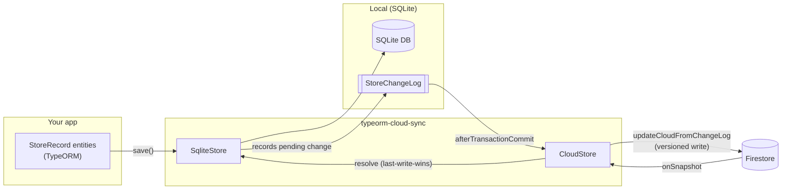

# typeorm-cloud-sync

Local-first sync between a [TypeORM](https://typeorm.io/) SQLite database and a cloud backend.

Your app reads and writes its local SQLite database as usual. Every committed change is recorded in a
change log and pushed to the cloud in the background; every change from the cloud is streamed back
and merged into SQLite. The app keeps working offline, and the two stores converge whenever the
network is available.

Sync is defined against an abstract `CloudStore`, so the cloud backend is pluggable.
[Firebase Firestore](https://firebase.google.com/docs/firestore) is the first supported backend
(`CloudFirebaseFirestore`); others (e.g. CloudKit) are planned.

- **Local-first** — writes hit SQLite first and never block on the network; the cloud catches up.
- **Offline-tolerant** — pending changes are persisted in a change log and drained when connectivity returns.
- **Public & private data** — per-record scoping decides whether data lives under a shared collection or the signed-in user's document.
- **Versioned, transactional writes** — every record carries a monotonic `changeId` allocated in a Firestore transaction, so clients only download what they haven't seen.
- **Multi-tenant** — run several signed-in accounts side by side, each on its own isolated database and cloud binding.
- **Pluggable backends** — sync targets an abstract `CloudStore`; Firestore ships today, other backends (e.g. CloudKit) are planned.
- **SDK-agnostic write protocol** — the same versioning code runs on the client (Firebase Web SDK) and in a Cloud Function (Admin SDK).

---

## Contents

- [How it works](#how-it-works)
- [Requirements](#requirements)
- [Installation](#installation)
- [Quick start](#quick-start)
- [Core concepts](#core-concepts)
- [Firestore data layout](#firestore-data-layout)
- [Multi-tenant usage](#multi-tenant-usage)
- [Server-side writes (Cloud Functions)](#server-side-writes-cloud-functions)
- [Lifecycle & disposal](#lifecycle--disposal)
- [API reference](#api-reference)
- [Development](#development)
- [Limitations & known issues](#limitations--known-issues)
- [License](#license)

---

## How it works



1. **A local write** to any `StoreRecord` subclass persists to SQLite and inserts a `StoreChangeLog`
   row naming the changed record.
2. **On transaction commit**, `StoreChangeLogSubscriber` triggers a background drain
   (`CloudStore.updateCloudFromChangeLog`). Each pending change is written to Firestore through the
   versioned write protocol, which reads the collection's `Meta` document and the record's cloud copy
   inside one transaction, allocates the next `changeId` and bumps `Meta`. If the cloud copy carries a
   newer `updatedMs`, the write is skipped and the drain stores that copy locally instead, so local
   equals cloud either way.
3. **Cloud changes** arrive as a paged catch-up followed by a live `onSnapshot` listener that
   consumes only the snapshot's added and modified documents. Each collection keeps a
   download cursor in the local `Meta` table: the highest `changeId` the cloud has delivered and the
   device has applied. Only records above it are fetched. Uploads never move it, so a document another
   device wrote below a locally uploaded `changeId` still arrives. A document whose `changeId` is not
   above the local row's is dropped before it is written. Records with a pending
   local change are merged by `SqliteStore.resolve` using last-write-wins on the record's `updated`
   timestamp; the rest — the whole page on an initial login — have no local edit to protect and are
   written to SQLite in a single chunked bulk save, so a large first download is a handful of writes
   rather than one round-trip per record.

The library never blocks a local commit on the network. The change log is the source of truth for
"what still needs to go up," so a dropped connection or a crash only changes *when* the cloud catches
up, never *whether* it does.

---

## Requirements

`typeorm-cloud-sync` targets the browser/mobile TypeORM build (`typeorm/browser`), which is what
Capacitor / Ionic apps use with [`@capacitor-community/sqlite`](https://github.com/capacitor-community/sqlite).

| Peer dependency | Version  |
| --------------- | -------- |
| `typeorm`       | `^1.0.0` |
| `firebase`      | `^12.0.0`|
| `rxjs`          | `^7.0.0` |

- Node `24.20.0` (see `.nvmrc`) for building and running the test suite.
- The package is pure ESM (`"type": "module"`) and ships TypeScript declarations.

> **TypeORM version note:** TypeORM `0.3.20` does not work with the Capacitor SQLite driver
> because of [capacitor-community/sqlite#512](https://github.com/capacitor-community/sqlite/issues/512#issuecomment-1925418022).

---

## Installation

```bash
npm install typeorm-cloud-sync typeorm firebase rxjs
```

Peer dependencies are installed alongside the package so your app controls their exact versions.

---

## Quick start

### 1. Define your entities

Entities extend `StoreRecord` and **must** declare a `static storeName`. That literal is the stable
identity used for change-log rows and Firestore collection paths — production bundlers mangle class
names, so `constructor.name` cannot be relied on.

```typescript
import { Column, Entity } from 'typeorm/browser';
import { StoreRecord, BaseUser } from 'typeorm-cloud-sync';

@Entity({ name: 'note' })
export class Note extends StoreRecord {
  static storeName = 'Note';

  @Column({ nullable: true })
  text?: string;

  constructor(init?: Partial<Note>) {
    super(init);
    Object.assign(this, init);
  }
}

// Your user model extends BaseUser; storeName must resolve to 'User' so the record
// lands on the auth-keyed cloud document.
@Entity({ name: 'user' })
export class User extends BaseUser {
  static storeName = 'User';
}
```

### 2. Wire up the local store

Create your TypeORM `DataSource`, then wrap it in a `SqliteStore`:

```typescript
import { DataSource } from 'typeorm/browser';
import { SqliteStore, StoreChangeLog } from 'typeorm-cloud-sync';

const dataSource = new DataSource({
  type: 'capacitor', // or 'sqljs' in tests, etc.
  // ...driver options...
  entities: [User, Note, StoreChangeLog, Meta],
  synchronize: true, // or migrations: see "The change log" for the ones this package exports
});
await dataSource.initialize();

const localStore = new SqliteStore(dataSource, User);
```

### 3. Connect Firestore

Pass your public and private record types, then initialize with the local store and your
`FirebaseApp`:

```typescript
import { initializeApp } from 'firebase/app';
import { CloudFirebaseFirestore } from 'typeorm-cloud-sync';

const app = initializeApp({ /* firebase config */ });

const cloud = new CloudFirebaseFirestore(
  User,        // user model
  [],          // public records (shared across all users)
  [Note],      // private records (scoped to the signed-in user)
);

await cloud.initialize(localStore, app);
```

That's it. From here, saving a record syncs it to the cloud automatically:

```typescript
await new Note({ text: 'hello' }).save();
```

`CloudStore` attaches its own subscribers to the `DataSource` during `initialize`, so you do **not**
need to register `StoreChangeLogSubscriber` / `BaseUserSubscriber` by hand.

---

## Core concepts

### StoreRecord

The base class for every synced entity (`StoreRecord extends BaseEntity`). It provides:

| Field / method            | Purpose                                                                 |
| ------------------------- | ----------------------------------------------------------------------- |
| `id`                      | UUID primary key.                                                       |
| `changeId`                | Monotonic version number, allocated in the cloud per collection.        |
| `isPrivate`               | `true` → scoped to the user; `false` → shared/public. Defaults to `true`.|
| `isDeleted`               | Soft-delete flag (deletes sync as updates, not row removal).            |
| `created` / `updated`     | Derived from `createdMs` / `updatedMs`, maintained on insert/update.    |
| `save()` / `saveWithManager()` | Persist and record a pending change for upload.                    |
| `static storeName`        | Stable storage identity — **declare this on every entity.**             |

### The change log

Every local write records a `StoreChangeLog` row (store name + record id) in the same transaction
as the record itself. There is one row per record; a further edit bumps the row's `version`.
`CloudStore.updateCloudFromChangeLog` drains these rows to the cloud and, after a successful upload,
deletes a row only if its `version` is still the one it read — an edit made while its record was
uploading stays queued for the next drain. Unsent rows survive restarts, which is what makes offline
edits durable.

A drain runs on every commit that queues a change, when the network comes back, and when a download
settles (including the private cloud finishing its setup). Call `CloudStore.drain()` from your app's
resume handler to cover the last trigger. Each upload has a timeout (15 s); an upload that fails or
times out leaves its row queued and the drain moves on to the next row.

Add `StoreChangeLog` and `Meta` to your `DataSource` entity list. A database created before
`version` existed needs the exported `AddStoreChangeLogVersion1789396900000` migration, and one
created before download cursors needs `MetaCursorIdentity1789400000000`, unless it runs with
`synchronize: true`. The first catch-up on such a database starts from the collection's highest local
`changeId`.

### Public vs. private records

- **Public** records sync to a top-level collection and are downloaded for every user.
- **Private** records sync under the signed-in user's document and require an authenticated user.
  A local `User` row may exist before it has an `authId` (to hold settings before sign-in); private
  sync waits, with its changes queued, until the row is saved with one.

You declare which is which when constructing the cloud store (the second and third constructor
arguments). A record's own `isPrivate` flag must match the list it's registered under.

**List a record after the records it references.** Collections are fetched concurrently but their
catch-up pages are stored in the declared order, so a row with a foreign key to another collection
never arrives before the row it points at. A live delivery that still cannot be stored (its
referenced row is in another listener's next delivery) is retried after the next delivery that
succeeds, and its collection's cursor does not move until it is stored.

### Conflict resolution

When a cloud record arrives, `SqliteStore.resolve` decides the winner:

- No local copy → insert the cloud record.
- Timestamps differ → **last-write-wins** on `updated`. If the cloud copy is newer, the pending
  change-log row is deleted by id and version and the cloud copy saved in the same transaction; an
  edit that landed since keeps its row and the cloud copy is discarded. If local is newer, local is
  kept and its row's version bumped so it uploads again.
- Equal timestamps → no-op.

The upload side applies the same rule: the writer skips a record whose cloud copy has a newer
`updatedMs`, and the drain stores that copy locally in place of the change it did not upload.

Cloud-origin saves run with entity listeners off, so `@BeforeInsert`/`@BeforeUpdate` hooks never
overwrite the timestamps a document carries, and your own entity subscribers do not fire for them.
Subscribe to `applied$` instead (see Reactive state).

### Reactive state

`CloudStore` exposes RxJS observables so your UI can react to sync state:

| Observable       | Emits                                                              |
| ---------------- | ----------------------------------------------------------------- |
| `network$`       | Online/offline state (defaults to browser `online`/`offline`).    |
| `user$`          | The current local `BaseUser`, or `null` when signed out.          |
| `downloading$`   | `true` while a cloud download/backfill is in flight.              |
| `applied$`       | `{ recordType, count }` after cloud-origin rows were written locally (a re-delivery that changed nothing does not emit). |
| `pending$`       | Number of change-log rows not yet uploaded; recounted on commit, drain and apply. Call `refreshPending()` after deleting rows yourself. |
| `lastError$`     | The most recent failed upload or private-cloud subscribe (`UploadTimeoutError`, a Firestore error), `null` once one succeeds. |

Network state can be injected as an `Observable<boolean>` (fourth constructor argument) so the store
can be built off-browser, e.g. in tests or SSR.

---

## Firestore data layout

How the Firestore backend (`CloudFirebaseFirestore`) lays out documents:

| Data              | Path                              |
| ----------------- | --------------------------------- |
| User document     | `User/{authId}`                   |
| Private records   | `User/{authId}/{StoreName}/{id}`  |
| Private meta      | `User/{authId}/Meta/{StoreName}`  |
| Public records    | `{StoreName}/{id}`                |
| Public meta       | `Meta/{StoreName}`                |

Each `Meta` document tracks the highest `changeId` allocated for its collection. A write reads it and
the record's current cloud copy, and bumps it in the same transaction, so `changeId` is strictly
increasing and clients can resume downloads with a single `where('changeId', '>', lastSeen)` query.
The first write to a collection creates its `Meta` document inside that transaction. An upload whose
`updatedMs` is older than the cloud copy's is skipped: that copy is a later edit, and the drain stores
it locally in place of the change it did not upload. A collection whose `Meta` was created at a random id by an earlier version continues
from that document's `changeId`.

---

## Multi-tenant usage

A `Tenant` bundles one account's isolated stack — its own `DataSource` (via `SqliteStore`) and its
own `CloudStore`. Isolation is structural: a query on one tenant's `DataSource` cannot return
another tenant's rows, so running N accounts concurrently is just a matter of holding N tenants.

`TenantRegistry` manages the set. You supply a `TenantOpener` that knows how to build a tenant for a
given `authId`; the registry handles deduplication (concurrent opens of the same account share one
tenant) and teardown.

```typescript
import { Tenant, TenantRegistry, SqliteStore } from 'typeorm-cloud-sync';

const registry = new TenantRegistry(async (authId) => {
  const dataSource = await buildDataSourceFor(authId); // app-owned
  const localStore = new SqliteStore(dataSource, User);
  const cloud = new CloudFirebaseFirestore(User, [], [Note]);
  await cloud.initialize(localStore, buildFirebaseAppFor(authId));
  return new Tenant(authId, localStore, cloud);
});

const tenant = await registry.open('auth-A'); // idempotent
// ...use tenant.localStore / tenant.cloud...
await registry.close('auth-A');  // disposes cloud, waits for quiescence, destroys DataSource
await registry.closeAll();
```

The app owns the pieces the library cannot build for it — the `DataSource` (driver, entities,
migrations) and the cloud binding (a `FirebaseApp` per account).

---

## Server-side writes (Cloud Functions)

The versioning logic is factored out of the Firebase-specific client so it can run anywhere. The
write protocol (`StoreRecordWriter`) speaks only in string document paths and plain data objects,
against an SDK-agnostic `FirestorePort`:

- The **client** binds it to the Firebase Web SDK via `WebFirestorePort` (done for you inside
  `CloudFirebaseFirestore`).
- A **Cloud Function** can bind the *same* `StoreRecordWriter` to a `FirestorePort` backed by the
  Admin SDK, so the client and server never drift on how a `changeId` is allocated or a `Meta`
  document is bumped.

```typescript
import { StoreRecordWriter, PathBuilder, FirestorePort } from 'typeorm-cloud-sync';

class AdminFirestorePort implements FirestorePort {
  // implement getDoc / setDoc / deleteDoc / queryMeta / runTransaction
  // using firebase-admin
}

const paths = new PathBuilder(() => currentAuthId);
const writer = new StoreRecordWriter(new AdminFirestorePort(), paths);
await writer.updateStoreRecord(versionedRecord);
```

`FirestorePort`, `WriteTxn`, `DocSnap`, and `VersionedRecord` are exported to help you implement a
binding. `VersionedRecord` is the minimal record view the protocol needs (it deliberately is **not**
a `StoreRecord`, since the server has no access to your TypeORM entity classes).

---

## Lifecycle & disposal

- `CloudStore.dispose()` marks the store disposed, detaches subscribers, unsubscribes from the
  private cloud and completes `applied$`, `pending$` and `lastError$`. Work already queued on the
  transaction lock finds the flag set and does nothing.
- `CloudStore.whenIdle(timeoutMs = 5000)` resolves once no drain, download or serialized local
  transaction is in flight, so you can tear down a `DataSource` without pulling it out from under one.
  It is bounded, so a stuck cloud call cannot block disposal forever.
- `Tenant.dispose()` orders this correctly: it stops the cloud, waits for quiescence, then destroys
  the `DataSource`.
- `CloudStore.resetLocalUser()` clears the current user (e.g. on sign-out), which unsubscribes from
  private cloud data.

---

## API reference

Everything is exported from the package root.

**Models**

- `StoreRecord` — base class for synced entities.
- `BaseUser` — base user entity (`authId`, `email`, `displayName`, …).
- `StoreChangeLog` — the pending-change log entity (add to your `DataSource`).
- `Meta` — per-collection download cursor (add to your `DataSource`).

**Migrations**

- `AddStoreChangeLogVersion1789396900000` — adds `StoreChangeLog.version`.
- `MetaCursorIdentity1789400000000` — rekeys the local `meta` table on `(collection, isPrivate)`.

**Stores**

- `SqliteStore` — wraps a `DataSource` and routes all persistence through its `EntityManager`.
- `CloudStore` — abstract base defining the sync contract and reactive state (`applied$`,
  `pending$`, `lastError$`, `downloading$`; see Reactive state). `AppliedRecords` is the `applied$`
  payload type; `UploadTimeoutError` is what `lastError$` carries after a timed-out upload.
- `CloudFirebaseFirestore` — Firebase Web SDK implementation of `CloudStore`.
- `serializeLocalTransaction(manager, work)` — the per-DataSource transaction lock every library
  write takes; use it around an app transaction that writes directly (see Limitations).

**Multi-tenant**

- `Tenant`, `TenantRegistry`, `TenantOpener`.

**Write protocol (client + server)**

- `StoreRecordWriter`, `WriteOptions`, `WriteResult` (`{ record, newerCloudCopy? }`)
- `PathBuilder`, `PathTarget`
- `FirestorePort`, `WriteTxn`, `DocSnap`, `VersionedRecord`
- `WebFirestorePort` — Web SDK binding.

**Subscribers** (attached automatically by `CloudStore`; exported for advanced/manual wiring)

- `StoreChangeLogSubscriber`, `BaseUserSubscriber`.

---

## Development

```bash
npm run build     # tsc → lib/
npm run watch     # tsc --watch
npm test          # jest
npm run format    # prettier
```

To try a local build in another project, pack it and install the tarball:

```bash
npm pack
npm install /path/to/typeorm-cloud-sync-<version>.tgz
```

---

## Limitations & known issues

- **Only the library's own transactions are serialized.** sqljs and Capacitor share one query runner
  per DataSource, so overlapping transactions nest. `saveWithManager`, `saveAllWithManager`, the drain
  and cloud applies run one at a time per DataSource; an app transaction that writes directly should
  go through `serializeLocalTransaction(manager, work)` too, or pass its transaction manager on to
  `saveWithManager`.
- Requires the `typeorm/browser` build and is designed around Capacitor SQLite; it is not aimed at
  server-side Node TypeORM drivers.

---

## License

[MIT](./LICENSE) © Michael Kasparian
